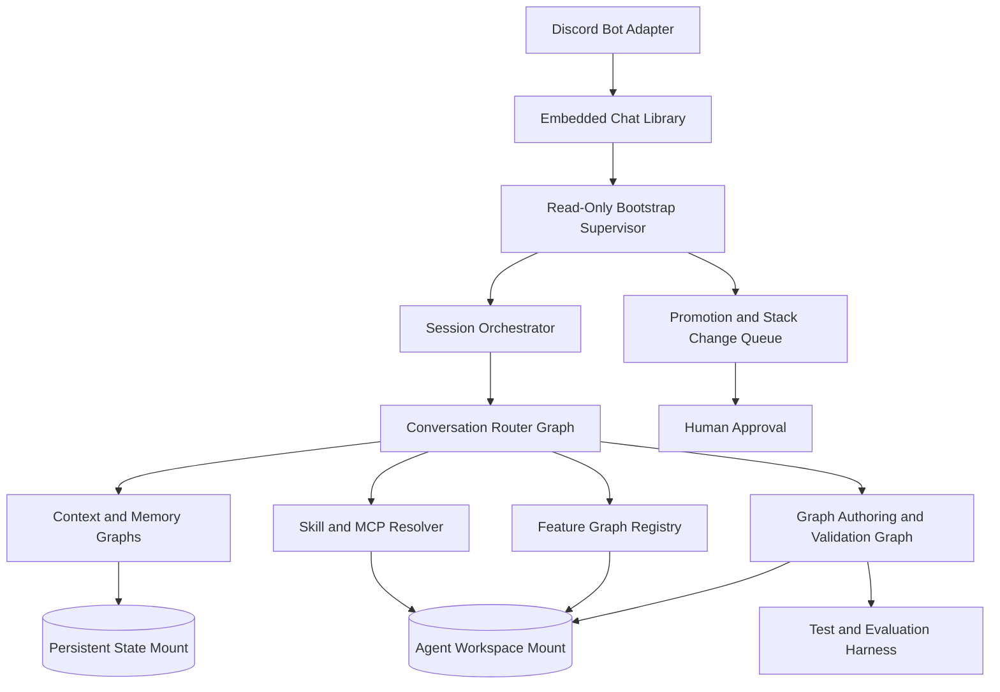

# Autonomous Life Agent Plan

Status: Draft for collaboration and formal review

Date: 2026-04-14

Review update: 2026-04-15 interactive review decisions incorporated

## Intent

Build an autonomous personal helper that talks to you through Discord first, but is designed around a transport-agnostic chat interface so that additional communication surfaces can be added later without rewriting the agent core.

The agent should run inside Docker, start from a fixed bootstrap loop, and evolve primarily by changing its own writable workspace: PocketFlow graphs, prompts, tests, skills, tools, and supporting assets. The bootstrap loop and embedded communications library stay read-only so restart behavior remains predictable and the system always comes back through the same entry path.

This document is a planning artifact, not an implementation commitment. It is meant to give us a strong starting architecture and a concrete roadmap while leaving room for iteration.

## Requirements Captured From Discussion

- Discord is the initial point of contact.
- The communications layer should be flexible enough to swap or add other adapters later.
- Runtime should be containerized with Docker.
- A read-only bootstrap setup should launch the agent every time.
- The originating agent loop and communications libraries should remain read-only.
- The agent may evolve beyond the initial bootstrap internals, but it must always expect restart and re-entry through the bootstrap loop.
- The agent should always communicate with you through the embedded chat library.
- PocketFlow is the intended agent harness.
- The agent should be encouraged to create features as PocketFlow graphs and invoke them as needed.
- Network-based security is not a present requirement.
- The agent should have an isolated bind mount for its own code and assets.
- The agent may need additional resources and mounts over time.
- Non-temporary assets should have a path for recommending permanent stack or Docker changes.
- Some assets may remain ephemeral instead of being promoted.
- The agent should not ship hardcoded life-management use case solutions up front.
- The agent should be able to write, test, validate, and refine solutions itself, or ask you for input when the problem is ambiguous.
- We should be able to give it scaffolds, including skills, MCP integrations, and related conventions.
- The system must accommodate context-limited LLMs.
- The system should ship with sane default context-management hooks, while allowing the agent to experiment and improve them over time.
- Bootstrap should provide access to base identity and policy files plus writable overlays for personality and behavior evolution.
- The runtime will use llama-swap as the initial model backend.

## Guiding Principles

- Preserve a strict boundary between immutable runtime bootstrap and mutable agent workspace.
- Make chat transport a replaceable adapter, not an agent assumption.
- Treat PocketFlow graphs as the main unit of agent capability.
- Prefer agent-authored scaffolds and validation pipelines over manually hardcoding end-user features.
- Optimize for restart safety, inspectability, and recoverability before autonomy depth.
- Keep the default system minimal, but leave clean seams for skills, MCPs, retrieval, memory, and new tools.
- Default to explicit state and artifact manifests so a small-context model can recover its place after interruption.
- Keep the primary sandbox boundary at the container or VM runtime, not at prompt-time approvals.
- Track environment drift explicitly whenever the running container diverges from durable promoted state.

## Proposed System Boundaries

### Immutable bootstrap layer

This is shipped in the image and mounted read-only at runtime.

- Container entrypoint and supervisor loop.
- Minimal coordination agent runtime and base prompts.
- Embedded chat library abstraction.
- Discord adapter implementation.
- Message envelope schema.
- Agent session bootstrap and resume logic.
- Tool execution policy shell.
- Base health checks and observability hooks.
- Minimal typed capability catalog loader for discovering workspace capabilities without depending on mutable orchestration code.

This layer should not be self-modified by the agent. If the agent wants changes here, it should generate a proposal or patch for review and later bake that into a new image or stack revision.

### Mutable agent workspace

This is the agent-owned bind mount.

- PocketFlow graphs and subflows.
- Prompt assets.
- Local skills following the Agent Skills spec.
- MCP descriptors, tool wrappers, and adapter configs.
- Tests, validation harnesses, and fixtures.
- Long-lived notes, summaries, and structured memory indexes.
- Asset manifests describing persistent and ephemeral artifacts.
- Writable personality and behavior overlays.
- Agent-authored code for new capabilities.

The agent can read and write here freely.

### Persistent operational state

This is separate from the agent code mount so the agent can evolve its workspace without corrupting live state.

- Conversation journal and event log.
- Task ledger and work queue snapshots.
- Context summaries.
- Vector or keyword indexes if later added.
- Local cache and temporary promotion records.
- Approval queue for proposed permanent changes.

### External resource mounts

These are optional and declared, not assumed.

- Calendar exports.
- Notes directories.
- Documents.
- Media.
- Project repositories.
- Specialized data sources.

The default system should start with none of these beyond the agent workspace and state mounts. New resource access should be introduced through an explicit resource proposal workflow.

## Recommended Runtime Layout

| Path | Mode | Purpose |
| --- | --- | --- |
| `/opt/bootstrap` | read-only | Entrypoint, supervisor, comms abstraction, base runtime code |
| `/opt/bootstrap/comms` | read-only | Embedded chat library and Discord adapter |
| `/workspace/agent` | read-write bind mount | Agent-authored code, graphs, prompts, skills, tests |
| `/workspace/state` | read-write bind mount | Journals, memories, indexes, task state |
| `/workspace/resources` | read-write bind mount | Approved long-lived assets and imported resources |
| `/workspace/cache` | read-write bind mount | Ephemeral cache, temp outputs, short-lived artifacts |
| `/tmp` | ephemeral | Disposable runtime scratch space |

Two practical rules should hold:

- The bootstrap code never depends on mutable internals to start.
- The agent never assumes ephemeral paths survive restart.

## Deployment Baseline

The runtime baseline should be a `docker compose` project even if the first stack ships with only a single primary agent service.

This gives the system a stable contract for later expansion without forcing early complexity. The initial compose stack can remain simple while still reserving clean seams for later services such as vector stores, task workers, or model-serving sidecars.

Two practical consequences follow:

- Stack evolution should be expressed in compose-oriented artifacts and proposals from the start.
- The same architecture should also remain portable to a VM-style deployment with equivalent read-only bootstrap and writable workspace boundaries.

## High-Level Architecture



## Communication Model

The communication contract should be built around an internal chat API, not around Discord itself.

### Core idea

- Discord is only the first adapter.
- The initial Discord surface should be direct messages only.
- The bootstrap supervisor receives normalized message envelopes from the embedded chat library.
- The agent only sees a transport-neutral session object and replies through the chat library.
- Future adapters can implement the same envelope contract without changing core graphs.

### Suggested message envelope

- `channel_type`: `discord` today, more later.
- `channel_id`
- `user_id`
- `message_id`
- `timestamp`
- `text`
- `attachments`
- `reply_context`
- `session_id`
- `priority`
- `metadata`

### Why this matters

- It prevents Discord-specific assumptions from leaking into graph logic.
- It makes restart and replay simpler.
- It gives the agent one consistent communications surface.

## Bootstrap Runtime Contract

Every launch should follow the same pattern:

1. Read configuration and validate required mounts.
2. Initialize the embedded chat library and configured adapters.
3. Recover durable session state, task ledger, environment journal, and pending proposals.
4. Load the immutable base identity and policy files plus any writable overlays.
5. Expose current workspace capabilities, tools, memory, and state to the minimal coordination agent.
6. Start the message intake loop.
7. For each incoming message, create or resume a session shared store.
8. Let the coordination agent select a capability, triage the workspace, or continue existing work.
9. Persist outputs, summaries, and state deltas.
10. Send responses only through the embedded chat library.

The bootstrap loop should be restart-friendly rather than long-running-state-dependent. If the container dies, the system should be able to rebuild enough context from the persistent state mount to continue coherently.

### Coordination bootstrap behavior

The bootstrap loop is not supposed to implement deep reasoning about which capability is healthy. Its job is to bring up the agent, hand it the current state of the world, and let the coordination agent continue or triage from there.

The bootstrap should therefore:

- Assume the writable workspace is the current truth.
- Avoid maintaining a separate last-known-good capability snapshot as a primary runtime dependency.
- Still be able to launch the minimal coordination agent from the immutable layer if some mutable capability metadata is malformed.
- Provide the coordination agent with tool discovery paths, state locations, personality overlays, and diagnostic context so it can repair or downgrade behavior when needed.

## PocketFlow Strategy

PocketFlow should be the capability engine, not just a supporting library.

### Core modeling decision

Treat every significant capability as a graph with a defined shared-store schema and explicit validation behavior.

PocketFlow should be the default orchestration model for agent-authored capabilities, but not the only possible implementation language or runtime. The broader system should remain capable of registering tools, modules, or subagent loops implemented in other installed runtimes when that is useful.

### Default graph classes to plan for

- Conversation router graph.
- Memory maintenance graph.
- Context compaction graph.
- Skill lookup and selection graph.
- MCP capability discovery graph.
- Feature authoring graph.
- Test generation and validation graph.
- Promotion proposal graph.
- Recovery and resume graph.

### Why PocketFlow fits this design

- Graph plus shared-store semantics map well to durable task state.
- Node retries and fallbacks support brittle tool or LLM interactions.
- Async flows fit waiting for user input or long-running external work.
- Batch and parallel flow patterns fit indexing, validation suites, and multi-artifact processing.
- Flow-as-node composition supports nested capabilities without collapsing everything into one giant prompt.

### Design rule for agent-authored features

When the agent wants a new capability, it should prefer creating:

1. A design note with the graph purpose and shared-store contract.
2. One or more PocketFlow nodes and flows.
3. Utility wrappers for external tools.
4. Tests and validation fixtures.
5. A registry entry so the graph can be invoked intentionally.

This keeps the agent aligned with PocketFlow instead of drifting into ad hoc scripts everywhere.

## Capability Registry Strategy

The system should use a declarative-first capability registry that is language-neutral and searchable.

### Registry model

- Capabilities should be represented as typed declarative entries.
- Implementations may live in Python, PocketFlow graphs, shell tools, MCP-backed tools, or any other runtime available in the container.
- PocketFlow remains the default and preferred orchestration path for complex agent-authored capabilities.
- A capability is not loaded into context blindly; it is discovered through indexed metadata and selected intentionally.

### Unified typed catalog

The catalog should unify multiple artifact types under one searchable model instead of keeping disconnected registries.

Planned entry types include:

- PocketFlow graphs.
- Tools and wrappers.
- Skills.
- MCP-provided capabilities.
- Subagent loops.
- Persona overlays and other orchestrator-relevant assets when useful.

Each entry should declare its type so the agent can search broadly while still filtering intentionally.

### Registry storage shape

The preferred starting model is a blend of per-capability declarative manifests and a generated aggregate search index.

- Each capability owns its own descriptor.
- Bootstrap and maintenance flows generate a searchable aggregate index.
- The search index is meant for lookup and ranking, not for bulk prompt stuffing.

### Initial search strategy

Initial discovery should use structured metadata plus lexical search.

- Search names, tags, descriptions, manifests, indexed text, and lightweight references.
- Keep the results compact and ranked.
- Add semantic search later after the file-first registry and state model prove themselves.

### Capability lifecycle

The initial lifecycle should be:

- `draft`: newly created or modified, not yet trusted.
- `validated`: passed its defined validation checks.
- `active`: available for ordinary runtime selection.
- `promoted`: durable and considered part of the long-lived preferred capability set.
- `retired`: no longer used, but retained for traceability or rollback.

### Minimum manifest concerns

The exact schema can be decided later, but the registry needs to capture at least:

- Capability ID and type.
- Description and search metadata.
- Implementation language or runtime.
- Entrypoint or invocation contract.
- Validation contract and latest validation status.
- Lifecycle state.
- Dependency references.
- Durability or promotion status.
- Relevant state, memory, or tool references.

## Capability Development Model

The agent should not arrive with a long list of hardcoded life-management behaviors. Instead, it should operate as a capability builder.

### Default loop for new needs

1. Interpret your request and determine whether an existing graph already fits.
2. If not, design a new graph at a high level.
3. Scaffold the graph, utilities, prompts, and tests in the writable workspace.
4. Run validation.
5. Ask you for clarifying input when requirements or acceptable behavior are ambiguous.
6. Promote the graph into the registry once it meets its checks.

### Examples of what should be scaffolded instead of hardcoded

- Planning workflows.
- Reminder pipelines.
- Information triage flows.
- Personal knowledge organization helpers.
- Task decomposition assistants.
- Review and follow-up routines.

The important point is that these become authored capabilities with tests and explicit graph boundaries, not one-off prompt hacks.

The first runnable version should assume the agent can write code, run local tooling, and execute its own validation inside the writable workspace and approved mounts. The long-term direction is for durable changes to move through Git-backed workflows rather than only local file promotion.

The first runnable version should also assume the agent may author capabilities against any installed runtime in the container, as long as those capabilities remain discoverable through the registry and respect the runtime sandbox.

## Context Management Plan

Because the target models may have limited context windows, the system needs dedicated context-management hooks from day one.

### Default context layers

- Live session context: the current exchange and immediate working state.
- Rolling summary: compacted session summary for recent continuity.
- Task ledger: active goals, blockers, next actions, and deadlines.
- Long-term memory index: stable preferences, facts, and durable references.
- Capability catalog: graphs, tools, skills, prompts, tests, MCP entries, and related assets available to the agent.
- Retrieval layer: focused fetch of relevant notes, files, and prior outputs.

### Default context actions

- Summarize the last interaction window.
- Snapshot current task state.
- Retrieve prior similar tasks.
- Select only the most relevant skills, graphs, and files.
- Compress verbose artifacts into structured notes.
- Expire or archive stale short-term context.
- Compare alternative summaries when the model appears to lose track.

### Sane default implementation

Start with a simple, inspectable strategy:

- Append every event to a durable journal.
- Maintain a rolling session summary.
- Maintain a task ledger in structured text or JSON.
- Keep a searchable typed capability catalog of agent-authored graphs, tools, skills, and related assets.
- Retrieve by recency plus lightweight semantic matching later, not necessarily on day one.

Durable state should begin as well-organized files and directories rather than requiring a database on day one. Semantic search, embeddings, and richer retrieval can be layered in after the file-first model proves workable.

### Evolvable context strategy

The agent should be allowed to experiment with better compaction and retrieval methods, but only inside the mutable workspace. That means it can replace or extend its context graphs, while the bootstrap contract for loading and saving state stays stable.

## Skills and MCP Strategy

The system should have clear places for agent skills and MCP integrations without assuming either is always required.

### Skills

Use the Agent Skills spec as the local packaging convention for reusable agent instructions.

- Each skill lives in its own directory with `SKILL.md`.
- Optional `scripts`, `references`, and `assets` directories are encouraged when they reduce prompt bulk.
- Skills should remain small and discoverable.
- The agent should maintain a local skill registry so it can load the right scaffolds when a task pattern repeats.

### MCPs

Treat MCP servers as optional capability providers that the agent can discover, register, and recommend.

- MCP integrations should be described declaratively.
- The bootstrap layer should expose a stable capability interface to the agent.
- The agent can propose adding or enabling a new MCP, but permanent enablement should go through the promotion workflow.

### Design goal

Skills capture reusable instructions and process templates.

MCPs expose tools and external systems.

PocketFlow graphs orchestrate when and how either is used.

All of these should participate in the unified typed capability catalog so discovery is searchable and selection does not depend on raw filesystem traversal alone.

## Model Management Strategy

The initial model backend should be llama-swap.

### Initial policy

- The agent may switch among approved configured models autonomously.
- The agent may research and recommend additional models to add.
- Adding new models to the durable stack remains a promotion event rather than an invisible runtime mutation.

### Why this matters

- Model choice stays behind a stable backend contract.
- The agent can adapt model selection by task without forcing a provider redesign.
- Model expansion remains reviewable when it requires stack changes.

## Promotion Workflow For Durable Enhancements

The agent needs a way to distinguish between temporary artifacts and assets worth making permanent.

### Artifact classes

- Ephemeral: scratch files, short-lived caches, temporary notes, one-off experiments.
- Durable workspace assets: graphs, tests, prompts, skills, local tools, useful notes.
- Stack-level changes: Dockerfile changes, compose changes, new mounts, new services, new environment contracts.

### Proposed workflow

1. The agent creates or updates something in the writable workspace.
2. It records whether the artifact is ephemeral or promotable.
3. If promotable, it generates a recommendation package containing rationale, expected value, required stack changes, and validation results.
4. Durable workspace assets can be promoted directly into the agent workspace registry after validation.
5. Stack-level changes go into a review queue for human approval and later image or compose updates.

Near-term stack and Docker changes can be emitted as manifests, patches, or both. The intended mature workflow is to have the agent prepare Git-reviewable changes, ideally as PR-style units for you.

Approval is therefore primarily about durable architectural exposure, not about ordinary autonomous execution inside the already-approved runtime boundary.

### Why this matters

- The agent can evolve continuously without silently mutating the runtime contract.
- Permanent changes remain inspectable.
- Ephemeral exploration stays cheap.

## Runtime Mutation and Drift

The first version should allow the agent to change anything inside the running container, including packages, runtimes, tools, and local environment details.

That flexibility comes with a required bookkeeping rule: runtime drift must be tracked explicitly.

### Required environment journal

The system should maintain an environment journal that records meaningful runtime changes such as:

- Package installations or removals.
- New tool availability.
- Runtime additions or version changes.
- Local service setup inside the container.
- Environment configuration changes the agent depends on.

### Durability rule

- If a capability depends on unpromoted runtime drift, it should be treated as ephemeral.
- If the agent wants that dependency to survive restart or host replacement, it should propose stack promotion.
- The environment journal should help the agent explain why something worked before and what must be promoted to keep it working.

## Filesystem and Resource Governance

The agent should have a strong default sandbox even without focusing on network security yet.

### Planned rules

- The agent only writes inside approved writable mounts.
- Bootstrap and comms code stay read-only.
- Additional resources are mounted by declaration, not by discovery alone.
- The agent can request new mounts or services, but cannot assume they exist.
- Runtime scratch space can be cleared at any restart.
- The primary trust boundary is the runtime sandbox. If the runtime exposes a resource, the agent may use it autonomously unless a higher-level policy says otherwise.
- Direct host access should not exist unless you intentionally provide it through the runtime.

### Resource proposal examples

- Add a persistent documents mount.
- Add a local SQLite or Postgres sidecar.
- Add a vector store service.
- Add a calendar export mount.
- Add a secrets source later when network security becomes relevant.

## Observability and Recovery

This system will be easier to trust if it is easy to inspect.

### Minimum planned observability

- Structured event log for every message and graph run.
- Per-session summary snapshots.
- Graph execution traces and chosen actions.
- Validation history for agent-authored capabilities.
- Promotion history for durable changes.

### Recovery expectations

- A restart should not lose durable task state.
- The agent should be able to explain what it was doing before a restart.
- Long-running tasks should recover from the task ledger or be marked for re-evaluation.
- Failed graph runs should leave behind enough trace data to debug them.

## Initial Roadmap

### Phase 0: Planning and repo scaffold

- Create the repository structure.
- Create the compose baseline, even if it initially contains only one primary agent service.
- Define the bootstrap and workspace boundary.
- Define the state schema at a high level.
- Define the initial registry contracts for capabilities, skills, tools, and proposals.

### Phase 1: Bootstrap runtime and Discord entry path

- Implement the read-only bootstrap supervisor.
- Implement the minimal coordination agent that always starts from the immutable layer.
- Implement the embedded chat library contract.
- Implement the Discord adapter.
- Keep the initial Discord scope to direct messages only.
- Normalize inbound and outbound chat envelopes.
- Prove restart-safe session loading.

### Phase 2: PocketFlow core runtime

- Implement a conversation router graph.
- Implement base shared-store schemas.
- Add capability registration, search, and invocation.
- Add default retries and fallback conventions.
- Add a minimal validation harness.

### Phase 3: Context and memory hooks

- Add event journal persistence.
- Add the environment journal for runtime drift tracking.
- Add rolling summaries.
- Add task ledger management.
- Add retrieval hooks for capabilities, skills, and notes.
- Add context compaction flows.

### Phase 4: Agent-authored capability creation

- Add feature graph and capability scaffolding.
- Add prompt, utility, and test templates.
- Add automated validation for new graphs.
- Allow autonomous local authoring, tooling, and test execution inside the writable workspace.
- Add approval boundaries for ambiguous or sensitive actions.

### Phase 5: Skills and MCP integration

- Add local skills registry and loader.
- Add MCP descriptors and tool discovery.
- Add graph patterns that decide when to use skills versus MCP tools.
- Fold both into the unified typed capability catalog.

### Phase 6: Promotion and stack evolution

- Add proposal manifests for durable workspace assets.
- Add review packages for Docker and stack changes.
- Shape promotion outputs so they can evolve into Git-reviewed PR-style changes.
- Add a promotion queue and human approval path.

### Phase 7: Hardening and evaluation

- Add end-to-end recovery tests.
- Add regression tests for graph behavior.
- Measure context usage, compaction quality, and feature reuse.
- Identify the next operational bottlenecks.

## Suggested Validation Strategy

Even in a planning-first repo, validation should be designed early.

### Tests to expect eventually

- Bootstrap restart tests.
- Chat adapter contract tests.
- PocketFlow graph unit tests.
- Capability registry integration tests.
- Context compaction regression tests.
- Capability scaffolding tests.
- Promotion workflow tests.
- Filesystem boundary tests.
- Environment journal and drift tests.

### Manual checks to expect eventually

- Send a message in Discord and verify normalized ingestion.
- Kill and restart the container during active work.
- Confirm the agent resumes with coherent task state.
- Create a new feature graph and verify test generation and validation flow.
- Propose a stack change and verify it lands in the right review queue.
- Mutate the running container, then confirm the environment journal explains the drift and the durability implications.

## Proposed Repository Shape

This is a suggested future layout, not an implementation step yet.

```text
docs/
  plans/
    autonomous-life-agent/
      2026-04-14-autonomous-life-agent-plan.md
bootstrap/
  supervisor/
  comms/
  runtime/
workspace/
  agent/
    graphs/
    nodes/
    utils/
    prompts/
    skills/
    mcp/
    tests/
    registry/
  state/
  resources/
  cache/
ops/
  docker/
  proposals/
```

## Interactive Review Outcome

### Review date

- 2026-04-15

### Review result

- Proceed with planning toward repo scaffold.
- Treat the remaining unknowns as implementation-detail decisions, not architecture blockers.

## Decision Baseline For Formal Review

### Resolved decisions from current discussion

- The first runnable version should allow the agent to write code, run local tooling, and execute its own tests inside the writable workspace and approved mounts.
- Durable state and memory should begin as well-organized files and directories, not as a database-first design.
- Semantic search and richer retrieval should be treated as later enhancements layered onto the file-first state model.
- Proposed Docker and stack changes may initially be emitted as manifests, patches, or both.
- The long-term promotion target should be Git-reviewed PR-style changes presented to you.
- The first version should assume a single-user model per container instance.
- The initial Discord surface should be direct messages only.
- The deployment baseline should be a compose project, even if the initial stack starts with one main service.
- The capability registry should be declarative-first, language-neutral, and searchable.
- The capability catalog should be unified and typed rather than split into disconnected registries.
- PocketFlow should be the default orchestration model, but capabilities may use any installed runtime when justified.
- The runtime boundary itself is the primary sandbox. If a resource is exposed to the runtime, the agent may use it autonomously.
- Approvals are primarily for durable architectural exposure such as new services, mounts, or stack changes.
- Identity and behavior should use an immutable base plus writable overlays.
- Bootstrap should always be able to launch a minimal coordination agent from the immutable layer.
- Bootstrap should treat the current workspace as the current truth rather than depending on a last-known-good snapshot.
- The initial model backend should be llama-swap.
- The agent may switch among approved models autonomously and propose new models for later promotion.
- Capability lifecycle should be `draft`, `validated`, `active`, `promoted`, and `retired`.
- Runtime drift inside the container is allowed, but it must be recorded in an environment journal.

### Remaining decisions to settle in formal review

- Exact capability manifest schema and index format.
- Exact compose service layout for the first runnable slice.
- Initial set of runtimes and tooling baked into the image.
- Initial approved model list exposed through llama-swap.

## Formal Review Guide

This section is intended to turn the next pass into an actual architecture review with decisions, risks, and exit criteria.

### Review objective

Validate that the proposed architecture is coherent enough to start scaffolding the repository and runtime without prematurely locking in the wrong boundaries.

### What the review should answer

- Is the bootstrap versus mutable workspace boundary strong enough?
- Is the PocketFlow-centered capability model the right default abstraction?
- Is the file-first state model adequate for the first runnable version?
- Are restart, recovery, and observability expectations concrete enough to implement?
- Is the promotion path for durable changes realistic?
- Are the remaining undecided items small enough to defer without blocking the first scaffold?

### Recommended review packet

- This plan as the primary architecture artifact.
- The high-level mermaid diagram.
- The resolved decision baseline.
- The remaining decisions list.
- A short list of top risks and assumptions.

### Suggested review agenda

1. Confirm problem framing, scope, and non-goals.
2. Review immutable bootstrap versus mutable workspace boundaries.
3. Review communication model and DM-only first transport assumptions.
4. Review PocketFlow graph model, capability scaffolding path, and validation loop.
5. Review state, memory, and context-management strategy.
6. Review promotion workflow, future Git path, and human approval boundaries.
7. Decide the remaining open items that block repo scaffolding.
8. Record a go, revise, or hold outcome for the first implementation slice.

### Review checklist

| Area | Review question | Exit criteria |
| --- | --- | --- |
| Bootstrap boundary | Can the runtime start safely even if the mutable workspace is incomplete or broken? | Bootstrap behavior is defined for empty, partial, and invalid mutable state without requiring image changes. |
| Communication contract | Is Discord-specific logic isolated behind the embedded chat library? | The agent core only sees normalized message envelopes and transport-neutral session state. |
| Discord first slice | Is DM-only enough to validate the architecture without leaking channel assumptions? | No graph, state, or registry design requires guild or channel semantics to function. |
| Capability model | Can major features be expressed as PocketFlow graphs instead of ad hoc scripts? | The plan defines graphs, shared-store contracts, utilities, tests, and registry entries as the default path. |
| Self-development loop | Can the agent safely author and validate new capabilities inside its writable sandbox? | Local authoring, tooling, and tests are allowed only inside approved writable mounts with traceable outputs. |
| State model | Is file-first durable state sufficient for startup and restart behavior? | Journals, summaries, task ledgers, and artifact registries can live as organized files without immediate database pressure. |
| Context management | Can a low-context model recover the working state after interruption? | Rolling summaries, task ledgers, artifact registries, and retrieval hooks are enough to reconstruct the next action. |
| Promotion path | Is the split between ephemeral assets, durable workspace assets, and stack changes clear? | The review agrees on what can self-promote, what requires approval, and what must become Git-reviewable later. |
| Observability | Will failures be inspectable enough to debug graph behavior and restart issues? | Event logs, graph traces, validation history, and promotion history are all part of the first design baseline. |
| Deployment growth | Can the architecture grow from the first runtime to Git-backed promotion, richer retrieval, and more adapters? | Current decisions do not block later Git workflows, semantic search, sidecars, or additional chat transports. |

### Red flags to challenge during review

- The bootstrap layer depends on mutable agent code to start cleanly.
- Discord concepts leak into graph logic or persistent state contracts.
- The first version quietly assumes a database or vector store before there is evidence it is needed.
- The agent can mutate durable runtime boundaries without a proposal or approval path.
- The self-development loop can run tools but cannot explain what it changed or why.
- Restart recovery depends on large raw chat history instead of compact durable state.

### Outputs to capture from the review

- Approved decisions.
- Rejected or deferred options.
- Top risks and mitigations.
- The first implementation slice and explicit non-goals.
- Any follow-up artifacts to create next, such as repo scaffold, runtime contract, or ADRs.

### Review notes from the current pass

- The biggest remaining risk is not transport or storage, but capability drift across mutable workspace state and mutable runtime state.
- The environment journal is therefore part of the architecture, not just an implementation convenience.
- The unified typed capability catalog is now the backbone for discovery, search, and controlled autonomy.

## Useful References

- PocketFlow guide: https://the-pocket.github.io/PocketFlow/guide.html
- PocketFlow agent pattern: https://the-pocket.github.io/PocketFlow/design_pattern/agent.html
- PocketFlow node model: https://the-pocket.github.io/PocketFlow/core_abstraction/node.html
- PocketFlow communication model: https://the-pocket.github.io/PocketFlow/core_abstraction/communication.html
- Agent Skills specification: https://agentskills.io/specification.md

## Collaboration Notes

If we keep using this file as the working design artifact, the next pass should probably do two things:

- Turn the remaining implementation-detail decisions into firm contracts.
- Replace the proposed repository shape with an actual implementation-oriented repo plan.
- Record ADR-style notes for capability manifests, environment journaling, bootstrap coordination behavior, and compose topology.